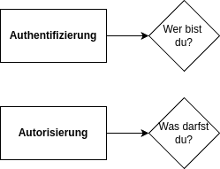
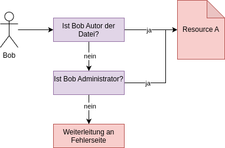

## Dynamisches Policy Management mit dem Open Policy Agent (OPA)

In dem letzten Artikel zu dem Thema "Moderne Berechtigungssteuerung" im Java aktuell 02/25 wurden die grundlegenden Funktionen und Methodiken von Access Control (zu deutsch "Zugriffssteuerung") im Allgemeinen und in der Jakarta EE Welt im Speziellen angeschaut. Besonders hervorzuheben sind dabei die Jakarta Security [1], Jakarta Authentication [2] und Jakarta Authorization [3] Spezifikationen. In der Regel wird im Zuge der Applikationsentwicklung nicht direkt mit den beiden low-level Service Provider Interfaces ("SPI") von Jakarta Authentication und Jakarta Authorization kommuniziert, sondern mit dem top-level API von Jakarta Security. Dabei stellt die Spezifikation Funktionen zur Verfügung, um die zentralen Herausforderungen der Zugriffssteuerung angehen zu können: Authentifizierung und Autorisierung (siehe Bild 1). Wie schon im ersten Artikel dieser Reihe soll der Fokus weiterhin auf der Autorisierung liegen und nicht auf der Authentifizierung.



Historisch orientiert sich die Jakarta EE [4] (vormals Java EE) Umwelt an einer monolithischen Entwicklungsstruktur. Alle deployment-relevanten Artefakte wie Beans, Servlets und Views werden zusammen mit dem Deployment Descriptor verpackt und in einem Applikationsserver ausgerollt. Nachvollziehbarerweise orientieren sich die Spezifikationen rund um das Thema Sicherheit und Zugriffssteuerung an der gleichen Vorgehensweise, sodass auch der Jakarta Security Code verpackt und mit in das Monolithen-Archiv geschnürt wird.

Wenngleich mit Jakarta Security der Anwendungsentwicklung eine mächtige Spezifikation an die Hand gegen wird, um viele der gängigen Herausforderungen im Zuge der Zugriffskontrolle zu begegnen, bleibt ein zentrales Manko zurück: Anwendungs-Code und Zugriffskontrolle sind sehr eng miteinander verbunden. Durch Design-Ansätze wie aspektorientierte Programmierung wird zwar einiges getan, dass die beiden Belange so lose wie möglich miteinander gekoppelt sind - eine gewisse Verbundenheit bleibt aber durch die gemeinsame Paketierung in ein Archiv immer. Leserinnen und Leser der Java aktuell (oder anderer Fachliteratur) werden den in den letzten Jahren vorherrschenden Trend der losen Kopplung von Concerns (Angelegenheiten; Belange) und Abhängigkeiten bis hin zu Microservice-Infrastrukturen mit dutzenden von verschiedenen Services unweigerlich mitbekommen haben. Jedoch steht das Ziel einer möglichst voll umfänglichen Entkopplung einzelner Services oftmals konträr gegenüber Querschnittsbelangen, wie die der Zugriffssteuerung. Im schlimmsten Fall führt dies zu einer notwendig gewordenen Redundanz von Logik und Code über zahlreiche Artefakte hinweg.

### Eine fachliche Policy = eine technische Implementierung?

Zugriffsbeschränkungen entstehen in den seltensten Fällen in einem luftleeren Raum. Vielmehr bilden sogenannte Policies (frei übersetzt "Richtlinien") aus der fachlichen Domäne die Grundlage für die konkrete technische Implementierung einer Prüfung. Hierbei kommt es in modularisierten Anwendungen öfter vor, dass sich eine Richtlinie nicht explizit und ausschließlich auf ein Modul oder noch kleiner auf einen Service eines Moduls beschränkt. Vielmehr umfasst das Thema Zugriffssteuerung oft einen breiten Pool an Modulen und wird nicht immer wieder neu definiert. Dieses Phänomen kann, wie weiter oben schon ausgeführt, dazu führen, dass die Realisierung einer Policy in mehreren Deployment-Einheiten redundant implementiert werden muss. Wie angehenden Entwicklerinnen und Entwicklern schon früh eingeflößt wird, bringt Redundanz in Code einige Herausforderungen mit sich, welche hier nicht noch einmal wiederholt werden müssen. Eleganter wäre es für diesen Fall, wenn die Realisierung der Policy nur an einer Stelle erfolgen müsste und von beliebigen Services oder Modulen genutzt werden kann.

Genau hier versucht der Open Policy Agent [5] anzusetzen. Die unter der Apache 2.0 lizensierte und in Go geschriebene Software [6] orientiert sich an einem einfachen Grundprinzip: Eine klare Trennung von "Policy decision making" und "Policy enforcement". Ins deutsche übertragen, lässt sich das Prinzip als eine Trennung der prüfenden Logik einer Richtlinie und der durchführenden Logik der Richtlinie beschreiben. Dieses im ersten Moment etwas kryptisch anmutende Konzept lässt sich leicht durch ein Schaubild verdeutlichen (siehe Bild 2). Das Subjekt Bob will auf die Resource A zugreifen. Der Prüfprozess ist als einfaches Flussdiagramm dargestellt. Werden die Schritte in einzelne Task untergliedert, lässt sich oftmals schnell der Teil der prüfenden Logik (im Schaubild lila dargestellt) von der durchführenden Logik (im Schaubild rot dargestellt) unterscheiden. Bei der Nutzung von Frameworks wie Jakarta Security wird in der Regel die durchführende Logik von dem Framework unter der Haube verwaltet. Einem unautorisierten Zugriff auf einen REST Endpunkt wird scheinbar "automatisch" mit dem richtigen 403 HTTP Code geantwortet, oder ein Browser Aufruf auf eine unerlaubte Seite wird "wie von Geisterhand" weitergeleitet. Das Durchführen der Richtlinie ist hierbei oft stark von der verwendeten Technologie und dem Einsatzzweck abhängig, sodass dies auch in den Händen der Frameworks und Libraries bleiben sollte. Die prüfende Logik hingegen hängt in der Regel an keiner bestimmten Technologie, sondern nur an der aus der fachlichen Domäne kommenden Policy. Genau diese lässt sich also sehr gut auslagern und der Open Policy Agent ist dabei eine willkommene Hilfe.



### Funktionsweise des OPA

Bei der Nutzung des Open Policy Agents werden die Richtlinien mit Hilfe der deklarativen Policy-Sprache "Rego" [7] (ausgesprochen als "ray-go") geschrieben und implementiert. Diese zeichnet sich durch sehr klare und - nach etwas Gewöhnung -  einfach zu lesende und schreibende Ausdrücke aus. Dabei werden Entscheidungen auf Basis hierarchisch strukturierter Daten getroffen. Die Informationen, die der Agent zur Entscheidungsfindung benötigt, können über verschiedene Interfaces per Push oder Pull synchron oder asynchron geladen werden. Alle Daten, die von extern kommen, werden im Datenmodell von OPA als "base documents" angesehen. Die Bezeichnung "document" hat seinen Ursprung aus den dokumentenbasierten Datenbanken und sollte nicht gleichgesetzt werden mit einer Datei auf dem Dateisystem. Neben den von außen kommenden Daten können auch Regeln innerhalb des Agents von anderen Regeln abhängen. Diese werden als "virtual documents" bezeichnet, um zu unterstreichen, dass sie von dem Agent berechnet wurden. Daten, die asynchron mit Push und Pull verarbeitet wurden, sind in allen Policies unter der globalen Variable `data` erreichbar. Informationen, die jedoch synchron zur Findung einer konkreten Entscheidung an den Agent gesendet werden, sind unter der Variable `input` referenzierbar.

#### Erste Schritte mit dem Agent

Der Agent kann als standalone Anwendung auf dem lokalen Host [8], als Docker Container [9] oder als Library direkt in Go Anwendungen ausgeführt werden. Da im Zuge der Artikels ein Blick auf die dynamischen Möglichkeiten bei der Nutzung der Agents geworfen werden soll, wird die letzten Option nicht näher beleuchtet. Bei den ersten beiden Optionen gibt es sowohl ein sehr umfangreiches Command Line Interface, als auch einen Server Modus, in dem ein REST API zur Verfügung gestellt wird. Läuft der Agent einmal, können über den Endpunkt `PUT v1/data` statische Daten ("base documents") an den Server übergeben werden (siehe Listing 1). Auf diese kann dann im Zuge der eigentlichen Regelprüfung zugegriffen werden. Die Daten werden im RAM gehalten und lassen sich auch partiell ändern oder wieder ganz löschen.

*Listing 1*
```json
{
  "departments": [
    {
      "id": 123,
      "timed_access": "full"
    },
    {
      "id": 456,
      "timed_access": "full"
    },
    {
      "id": 789,
      "timed_access": "day"
    }
  ],
  "timed_access": [
    {
      "id": "full",
      "from": 0,
      "to": 24
    },
    {
      "id": "day",
      "from": 9,
      "to": 18
    }
  ]
}
```

Wie schon erwähnt, werden die eigentlichen Policies in Rego geschrieben. Hierbei werden diese in für Java Entwicklungen vertraute Pakete gruppiert. Dies dient bei der Nutzung der Policies später der eindeutigen Identifizierung. Um den Umfang des Artikels nicht zu sprengen wird an dieser Stelle auf eine detaillierte Beschreibung der Sprache von Rego verzichtet. Eine ausführliche Dokumentation steht hierfür auf der Projektseite zur Verfügung [10]. Eine simple Policy besteht aus mindestens einer Regel. Wie aus dem Java Umfeld von Methoden und Funktionen bekannt, besteht eine Regel aus einem Rule Header und Rule Body. Dabei spiegelt der Rule Header eine Referenzierungsmöglichkeit als virtuelles Dokument wider, um diese auch in anderen Regeln zu nutzen. Eine simple Policy kann somit so aussehen wie in Listing 2.

*Listing 2*
```text
package timed

import rego.v1

default allow := false

allow := true if {
    input.department in allowed_department_access
}

allowed_timed_access contains allowed_time.id if {
    request_time := time.parse_rfc3339_ns(input.requestTime)
    request_hour := time.clock(request_time)[0]
    some allowed_time in data.timed_access
	    request_hour >= allowed_time.from
	    request_hour < allowed_time.to
}

allowed_department_access contains department.id if {
    some department in data.departments
	    department.timed_access in allowed_timed_access
}
```

Die fertige Policy wird mit der Endung `.rego` abgespeichert und kann an den Endpunkt `PUT v1/policies/{id}` an den Agenten übermittelt werden. In der in Listing 2 gezeigten Policy werden mehrere Regeln definiert. Zentral hierbei ist die Regel `allow` die per default auf `false` gesetzt wird. Sie löst sich auf `true` auf, wenn der Wert aus `input.department` in der Liste der `allowed_department_access` vorhanden ist. `allowed_department_access` ist hierbei ein virtuelles Dokument und setzt sich wiederum aus dem virtuellen Dokument `allowed_timed_access` zusammen. Aus der fachlichen Domäne bildet die Policy die Anforderung ab, dass bestimmten Departments nur in bestimmten Zeitfenstern ein Zugriff gewährt wird. Mit einer erfolgreichen Übertragung lassen sich jetzt `POST` Anfragen abschicken, welche als Body den für die Auswertung der Rule relevanten Input mitliefern (siehe Listing 3). Die URL setzt sich aus dem Package der Policy und der Referenz der Rule zusammen.

*Listing 3*
```http
POST /v1/data/timed/allow
Content-Type: application/json

{
  "input": {
    "department": 123,
    "requestTime": "2025-05-15T15:12:18.514567787+02:00"
  }
}
```

Die Möglichkeiten Regeln zu erstellen sind dabei mannigfaltig. Darüber hinaus gibt es zahlreiche Funktionen, die vom OPA bereit gestellt werden, um zum Beispiel mathematische Probleme zu lösen oder einen weiteren HTTP Aufruf zu starten [7].


### Anbindung an Jakarta EE

Um den Agent an eine Jakarta Anwendung anzubinden bedarf es nicht viel Drumherum, da die Kommunikation auf standardisierten Wegen mittels REST und JSON (oder anderem Format) vonstattengehen kann. Spannender hingegen ist eine sinnvolle Integration in die Anwendung. Out of the Box bietet Jakarta Security im Gegensatz zu Spring keine `PreAuthorize` oder `PostAuthorize` Annotationen [11] an, die genutzt werden könnten, um sich in den Aufruf einhängen zu können. Die schon im vorherigen Artikel kennen gelernten Annotation `RolesAllowed`, `PermitAll` und `DenyAll` [12] sind für diesen Anwendungsfall zu statisch. Mit Hilfe von einem oder mehreren CDI (Context and Dependency Injection) Interceptoren [13] kann diese Lücke aber geschlossen werden. So lässt sich zum Beispiel ein `OpaSecured`  Interceptor implementieren, der an den notwendigen Methoden bzw. Klassen ausgeführt werden soll (siehe Listing 4 und 5).

*Listing 4*
```java
@Inherited
@InterceptorBinding
@Retention(RUNTIME)
@Target({METHOD, TYPE})
public @interface OpaSecured {}
```

*Listing 5*
```java
@GET
@OpaSecured
public DummyResponse getDummy() {
  return new DummyResponse("GET /dummy");
}
```

Die konkrete Implementierung des Interceptors kann dann nach Belieben mit anderen Services interagieren um die eigentliche Abfrage an den Agent zu schicken. Hierbei ist zu beachten, dass der `SecurityContext` [14] aus dem `jakarta.security.enterprise` Package nicht garantiert injiziert werden kann. Der Glassfish Applikationsserver wirft bei einer direkten Verwendung eine Exception. In dem Beispiel in Listing 7 wird das Problem mit einer CDI gemanagten Bean gelöst (siehe Listing 6). Das Extrahieren des applikationseigenen `UserPrincipal` sollte aus dem ersten Artikel noch bekannt sein.

*Listing 6*
```java
@RequestScoped
public class SecurityContextProviderImpl implements SecurityContextProvider {

  @Inject private SecurityContext securityContext;

  @Override
  public UserPrincipal getCurrentPrincipal() {
    return securityContext.getPrincipalsByType(UserPrincipal.class).stream()
        .findAny()
        .orElseThrow(() -> new IllegalStateException("No user principal found"));
  }
```

*Listing 7*
```java
@OpaSecured
@Interceptor
@Priority(Interceptor.Priority.APPLICATION)
public class OpaInterceptor {

  @Inject private SecurityContextProvider securityContextProvider;

  @Inject private OpaClient opaClient;

  @AroundInvoke
  public Object checkSecurity(InvocationContext invocationContext) throws Exception {

    OpaSecured securedMetaData = invocationContext.getMethod().getAnnotation(OpaSecured.class);

    if (Objects.isNull(securedMetaData)) {
      securedMetaData = invocationContext.getTarget().getClass().getAnnotation(OpaSecured.class);
    }

    if (Objects.isNull(securedMetaData)) {
      return invocationContext.proceed();
    }

// Extrahieren von Meta-Informationen zu dem OPA Check aus der securedMetaData Annotation

    boolean allowed = opaClient.isAllowed(securityContextProvider.getCurrentPrincipal());

    if (allowed) {
      return invocationContext.proceed();
    }

    throw new SecurityException();
  }
}
```

Damit ist alles angerichtet, um in dem `OpaClient` die Query-Parameter in ein Request zu verpacken und mit dem favorisierten HTTP-Client abzuschicken (siehe Listing 8).

*Listing 8*
```java
@Stateless
public class SimpleOpaClient implements OpaClient {

  private static final String OPA_URL = "http://localhost:8888/v1/data/timed/allow";

  public record OpaRequest(OpaAllowedRequest input) {}

  public record OpaAllowedRequest(long department, OffsetDateTime requestTime) {
    private OpaAllowedRequest(long department) {
      this(department, OffsetDateTime.now());
    }
  }

  public record OpaAllowedResponse(boolean result) {}

  @Override
  public boolean isAllowed(UserPrincipal userPrincipal) {

    OpaRequest opaRequest = new OpaRequest(new OpaAllowedRequest(userPrincipal.getDepartmentId()));

    OpaAllowedResponse opaResponse =
        SimpleHttpClient.sendPostRequest(OPA_URL, opaRequest, OpaAllowedResponse.class);

    if (Objects.nonNull(opaResponse)) {
      return opaResponse.result();
    }

	throw new IllegalStateException("OPA response is not valid");
  }
}
```

Bei den Beispielen in den Listings ist zu beachten, dass sie stark vereinfacht wurden. Es wurde die komplette Autorisierung der Jakarta Anwendung gegenüber des Open Policy Agents vernachlässigt. Dieser sollte im Produktivbetrieb nicht einfach aus dem Netzwerk erreichbar sein. Ebenfalls untergräbt die statische Verwendung von einem Interceptor, der genau eine OPA Rule prüft, die erhoffte Dynamik durch die Nutzung des Agents. Dies kann über die in Listing 7 angedeutete Implementierung von Metadaten in der Interceptor Annotation verhindert werden. So kann zum Beispiel mittels Enums angegeben werden, welche Rule bzw. Policy geprüft werden soll.

### Fazit

Die Nutzung einer dedizierten Policy Engine wie dem Open Policy Agent bringt im ersten Schritt eine gewisse Komplexität mit sich. Neben der Aneignung der Sprache Rego, müssen auch Themen wie eine Deployment Strategie des neuen Services und die Erweiterung des bestehenden Codes berücksichtigt werden. Der Return On Investment ist jedoch nicht zu unterschätzen. Neben der Möglichkeit einer zentralen Verwaltung von Policies, die technologieübergreifend von allen Services genutzt werden können, wird die Nachvollziehbarkeit und Wartbarkeit einer der zentralsten Angelegenheiten des domänenspezifischen Business Codes spürbar erhört. Somit kann sich die Nutzung des Agents auch bei Deployments mit nur einem Artefakt anbieten.

Verändern sich jedoch die Basisdaten der Policies schnelllebig oder ist die notwendige Datenbasis zum Berechnen einer Entscheidung sehr groß, ist der Open Policy Agent nicht zwingend die beste Option. Im nächsten und letzten Artikel dieser Serie soll ein Blick auf die SpiceDB [15] geworfen werden, die eine Open Source Implementierung von Googles internem Autorisierungsystem Zanzibar [16] ist und eindrucksvolle Specs verspricht.

> Der Artikel ist zuerst im [Java aktuell Magazin 3/2025](https://meine.doag.org/zeitschriften/id.226.java-aktuell-3-25/) erschienen.
