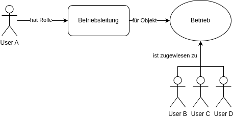

## Transitive Berechtigungen mit der SpiceDB

In den ersten beiden Artikel dieser Serie wurden die Autorisierungs-Mechanismen von Jakarta EE [1], insbesondere Jakarta Security [2] beleuchtet. Dabei sind jedoch Herausforderungen aufgefallen, welche nicht ohne Weiteres mit den Jakarta Bordmitteln gelöst werden können. Gerade wenn die Anwendung an Größe zunimmt, Zugriffsregeln komplexer gestaltet werden oder Geschäftslogiken über mehrere Services verteilt sind, lassen sich Code-Smells wie Code-Duplizierungen oder schlechte Wart- und Erweiterbarkeit kaum vermeiden. Der im letzten Artikel (java aktuell 03/25) vorgestellte "Open Policy Agent (OPA)" [3] versucht durch die Trennung von Entscheidungsfindung / Prüfung und der Durchführung einer Richtlinie die Entscheidungslogik zentral zu bündeln, um somit die Handhabung dieser zu vereinfachen. Durch Jakartas Interceptoren aus der Context and Dependencies Spezifikation [4] lässt sich die Anbindung des Agents einfach in der Jakarta EE Anwendung umsetzen.

## Die Herausforderungen von transitiven Beziehungen

Die Jakarta Security Spezifikation, aber auch die grundlegende Konzeptionierung des Open Policy Agents orientieren sich an den in der IT-Welt weit verbreiteten "Role-Based Access Control (RBAC)" und "Attribute-Based Access Control (ABAC)" Modellen. Dabei werden eine statische Beziehung zwischen einem Subjekt (zum Beispiel ein User oder ein System), einer Rolle bzw. Attribut und einem Objekt aufgebaut. So kann zum Beispiel ein User mit der Rolle "Betriebsleitung" auf die Stammdaten eines Betriebes zugreifen und diese manipulieren. Spannend wird es jedoch, wenn die Mitarbeitenden des Betriebes verwaltet werden sollen. In den seltensten Fällen wird für jeden Mitarbeiter und jede Mitarbeiterin - in diesem Fall das Objekt - eine statische Rollen-Beziehung mit einem vorgesetzen User modelliert. Dies würde sich schnell in kleinteiligem Micro-Management verlieren. Vielmehr kommt aus der fachlichen Domäne die abgeleitete Anforderung, dass ein User mit der Rolle "Betriebsleitung" auf alle Mitarbeitenden des Betriebes zugreifen darf. Hier zeichnet sich schon eine erste transitive Beziehung ab (siehe Bild 1).



Weil die User B, C und D dem Betrieb zugeordnet sind, darf der User A, der ebenfalls eine Beziehung über die Rolle zu dem Betrieb hat, auf diese User zugreifen. In der analogen Welt sind abgeleitete Berechtigungen omnipräsent. Da eine Person in einem bestimmten Bezirk lebt, darf diese an den Wahlen dort teilnehmen. Oder durch die Mitgliedschaft in einem Fitnessstudio hat eine andere Person Zugriff auf das Online-Angebot des Studios. Mit dem Paper *Access Control Requirements for Web 2.0 Security and Privacy* von Dr. Carrie Gates aus dem Jahr 2007 [5] wurde der Begriff *Relationship-Based Access Control (ReBAC)* beschrieben als notwendige Weiterentwicklung aus den bestehenden Modellen wie RBAC. Es wird beschrieben als Wandel von "welche Rolle hat der Empfänger oder die Empfängerin der Daten" zu "in welcher Beziehung stehen Empfänger oder Empfängerin zu den Daten".

Mit Blick auf den Status Quo in der Jakarta Security Spezifikation ergeben sich aus den Anforderungen von ReBAC zwei zentrale Herausforderungen. Zum einen sind traditionelle relationale Datenbanksysteme nicht gut darin Abhängigkeits-Graphen zu traversieren. Insbesondere wenn die Anzahl an Ebenen wächst, hat dies einen erheblichen negativen Einfluss auf die Performance. Zum anderen kann der häufige Zwang SQL als Abfragesprache zu nutzen zu komplexen und kaum mehr lesbaren Code führen. Bei der Nutzung eines Policy Agents, wie dem OPA, fällt einem hingegen der eigentliche Vorteil der Zustandslosigkeit bei der Betrachtung der Anforderungen von ReBAC auf die Füße. Da der Agent selbst nicht dafür ausgelegt ist, Tausende bis Millionen von Datensätzen zu speichern, müssen die für die Prüfung relevanten Daten stets zunächst aus einem anderen persistenten Speicher geladen werden, um sie dem Agenten anschließend zur Berechnung zur Verfügung zu stellen.

## Googles Zanzibar und AuthZeds SpiceDB

Dieses Problem hatte die Entwicklungsabteilung von Google vor einigen Jahren auch, weswegen nach einer zentralen und einheitlichen Lösung gesucht wurde. Mit dem Projekt Zanzibar [6] wurde diese gefunden. Seit über 5 Jahren führt Zanzibar unzählige Berechtigungsprüfungen von zahlreichen Google Services weltweit durch. Zanzibar selbst ist Closed Source und für die allermeisten Projekte auch vollkommen überdimensioniert. 2019 wurde jedoch ein Paper [7] veröffentlicht, welches die theoretischen Grundlagen und Konzepte von Zanzibar der Öffentlichkeit zugänglich machte. Auf diesen aufbauend sind einige Open Source Projekte entstanden. Eines davon ist die SpiceDB [8] von AuthZed [9]. SpiceDB ist ein in Go geschriebenes Datenbanksystem, welches explizit für ReBAC von großen Enterprise Anwendung ausgelegt ist. Dabei stellt es sowohl Schnittstellen mittels gRPC [10] als auch  HTTP/JSON für die Verwaltung und Abfragen bereit. Wobei letztere beim Start von SpiceDB aktiviert werden muss. Zentrale architekturelle­ Konzepte sind an das Zanzibar Paper angelehnt, zu denen zum Beispiel eine verteilte, parallelisierte Graph-Engine und das Consistency Model gehören. Als Implementierung der Persistenzschicht können je nach Anforderungen zwischen In-Memory, Googles Spanner System [11], CockroachDB [12] oder PostgreSQL [13] und MySQL [14] gewählt werden. Um mit SpiceDB zu starten muss das Datenbanksystem selbst deployt werden. Dies kann entweder direkt als Binary geschehen oder in einem Container wie mit Docker (siehe Listing 1) [15].

*Listing 1*
```yaml
# docker-compose for local SpiceDB development
services:
  spicedb:
    image: authzed/spicedb:latest
    volumes:
      - ./certs:/certs
    command: >
      serve
      --log-level=debug
      --grpc-tls-cert-path=/certs/spicedb-cert.pem
      --grpc-tls-key-path=/certs/spicedb-key.pem
      --grpc-preshared-key=mysecretkey
	  --http-enabled
      --http-tls-cert-path=/certs/spicedb-cert.pem
      --http-tls-key-path=/certs/spicedb-key.pem
      --datastore-engine=memory
    ports:
      - "127.0.0.1:50051:50051"   # gRPC - the default gateway
      - "127.0.0.1:8443:8443"     # HTTP - if activated
```

Nützliche Informationen lassen sich dazu in den übersichtlichen Dokumentationen der SpiceDB finden [16]. Neben dem eigentlichen Datenbanksystem kann das featurereiche Command-Line Tool "zed" installiert werden, um mit der SpiceDB zu interagieren. Da als Schnittstellen aber die Standards HTTP/JSON und gRPC zum Einsatz kommen, kann auch mit Hilfe eines Clients der eigenen Wahl mit der SpiceDB kommuniziert werden.

## Das Datenmodell der SpiceDB

Wie auch von relationalen Datenbanken bekannt, wird mittels eines Schemas [17] die Grundstruktur dar Daten definiert. Dies geschieht in Form einer eigenen Schema-Sprache, die nach etwas Übung sehr einfach zu lesen ist. Eine Schema-Definition besteht aus mindestens einer Objekt-Beschreibung. Ein Objekt ist am ehesten mit einer traditionellen Datenbank-Tabelle vergleichbar. Ein simples Objekt kann einfach mittels einer Zeile beschrieben werden (siehe Listing 2).

*Listing 2*
```text
/**
 * a simple object
 */
definition simpleobjecttype {}
```

Um nun die schon mehrmals angesprochene Stärke der Beziehungen zu definieren, reicht die Angabe mittels des Keywords `relation`. So kann die Beziehung zwischen einem `user` und einem `department` wie in  Listing 3 beschrieben werden.

*Listing 3*
```text
/**
 * user represents a system user
 */
definition user {}

/**
 * department represents a department in the system
 */
definition department {
	/**
	 * manager relates a user that is a manager on the department
	 */
	relation manager: user
}
```

Jede Beziehung hat einen in dem jeweiligen Kontext eindeutigen Namen. In dem Fall von Listing 3 ist dies `manager`. Es wird empfohlen Beziehungen immer als Nomen anzugeben: `reader`, `owner`, `manager`, usw. . Definierte Relationen können wiederum von anderen Relationen als Referenz genutzt werden. So können vielschichtige Vererbungen definiert werden.

*Listing 4*
```text
definition user {}

definition department {
	/**
	 * employee can include both users
	 * and the set of employees of other specific department.
	 */
	 relation employee: user | department#employee
}
```

In Listing 4 kann die Beziehung `employee` eines `departments` entweder direkt auf einen `user` zeigen oder auf die Menge aller `employees` eines bestimmten `departments`.

Neben dem `relation` Keyword gibt es noch `permission`. Eine `permission` definiert einen berechneten Satz von Subjekten, welche auf bestimmte Weise Zugriff auf ein Objekt haben. Ein `manager` darf die Liste aller `employees` einsehen. Eine solche Erlaubnis benötigt für die Definition einen Namen und einen Ausdruck, der die Berechnung der Menge von Subjekten beschreibt (siehe Listing 5).

*Listing 5*
```text
definition user {}

definition department {
	relation manager: user
	relation employee: user | department#employee

	/**
	 * view_employees determines whether a user
	 * can view the employee list of the department
	 */
	permission view_employees = manager
}
```

Dabei können die Operatoren `+` (Vereinigung), `&` (Schnittpunkt), `-` (Ausschluss) und `->` (abhängige Hierarchien) verwendet werden.


## Interagieren mittels zed

Um nun die laufende SpiceDB mit den Daten zu versorgen kann das schon erwähnte Command-Line Tool zed genutzt werden. Um nicht bei jedem Kommando immer wieder globale Parameter wie Host, Port oder Secret angeben zu müssen, kann ein sogenannter `Context` angelegt werden (siehe Listing 6). Gerade für das lokale Testen und Ausprobieren kann dies sehr nützlich sein.

*Listing 6*
```bash
# create a context. Use --insecure no TLS should be used
zed context set playground localhost:50051 mysecretkey --insecure

# use the created context
zed context use playground
```

Eine Schema-Datei (mit der Endung `.zed`) kann mithilfe des `schema` Kommandos in die Datenbank geschrieben werden (Siehe Listing 7).

*Listing 7*
```bash
# write schema
zed schema write schema.zed

# read current schema
zed schema read
```

Beziehungen können dann mit dem dazugehörigen `relationship` Kommando in dem System angelegt werden. Dabei erwartet zed als Parameter erst das Objekt, dann die Beziehung und dann das Subjekt der Beziehung. Referenziert werden bestimmte Objekte mit der Syntax `object_type:object_id`. Listing 8 legt die Beziehung `user1` ist `manager` von `dep1` an. Nach der Anlage kann mit dem `permission check` validiert werden, ob das Subjekt `user:user1` die Berechtigung `view_employees` zu dem Objekt `department:dep1` hat. Als Antwort wird ein kurzes `true` oder `false` zurückgegeben.

*Listing 8*
```bash
# create a new relationship
zed relationship create department:dep1 manager user:user1

# check permission on newly created relationship
zed permission check department:dep1 view_employees user:user1

true
```

Da die Zusammensetzungen von Berechtigungen und Beziehungen in realen Anwendungsfällen durchaus komplex ausfallen können, gibt es die sehr hilfreiche Flag `--explain` für den `permission check` Befehl. Mit der Angabe der Flag wird der Graph im Terminal dargestellt, wieso eine Entscheidung so ausgefallen ist wie sie ist (siehe Listing 9).

*Listing 9*
```bash
# check permission with explanation
zed permission check --explain department:dep1 view_employees user:user1
true
✓ department:dep1 manager (32.735µs)
└── user:user1
```


## Anbindung an Jakarta EE

Das Kommandozeilen-Tool ist sehr ausgereift und erleichtert das schnelle Testen von Schema, Beziehungen und Berechtigungen erheblich. Doch für den produktiven Betrieb von Enterprise Anwendungen bietet sich die Nutzung selbstredend nicht an. AuthZed bietet aus dem Grund für verschiedene Programmiersprachen offizielle SDKs an [18]. Daneben gibt es auch einige von der Community entwickelte Libraries. Per Default baut SpiceDB auf dem gRPC Protokoll auf. Dies ermöglicht unter anderem eine wesentlich effizientere Kommunikation als über HTTP/JSON. Aus diesem Grund setzt auch das Java SDK auf dieser Technologie auf. Für Personen, die nie Kontakt zu gRPC hatten, mag der Aufbau im ersten Moment etwas sperrig erscheinen. An dieser Stelle sei auf die gut aufbereitete Dokumentation unter [10] verwiesen.

Ähnlich wie bei der Anbindung des Open Policy Agents aus dem vorherigen Artikel, bietet es sich an die Integration der SpiceDB Anbindung mit Hilfe von einem oder mehreren CDI (Context and Dependency Injection) Interceptoren [4] umzusetzen. Dadurch lässt sich eine lose Kopplung zwischen Applikations-Code und der Autorisierungsimplementierung erreichen. Die eigentliche Verbindung zu der SpiceDB wird über einen `ManagedChannel` aus dem `io.grpc` hergestellt. Unter Nutzung dieses Channels kann dann ein `PermissionsServiceGrpc.PermissionsServiceBlockingStub` angelegt werden. Diese gRPC Stub Klasse aus dem `com.authzed.api.v1` Paket stellt dann die eigentlichen APIs für die Interaktion mit der Datenbank zur Verfügung. Listing 10 zeigt einen Verbindungsaufbau exemplarisch.

*Listing 10*
```java
private static final String HOST = "localhost";
private static final int PORT = 50051;
private static final String SECRET = "mysecretkey";

private final PermissionsServiceGrpc.PermissionsServiceBlockingStub permissionsService;

public SpiceDBClient() {
  ManagedChannel channel = ManagedChannelBuilder
	  .forAddress(HOST, PORT)
	// .usePlaintext() is only suitable for local dev setups.
	// Use TLS in prod environments
	  .usePlaintext()
	  .build();

  permissionsService =
      PermissionsServiceGrpc.newBlockingStub(channel)
          .withCallCredentials(new BearerToken(SECRET));
}
```

Um nun eine Beziehung in das bestehende Schema aus Listing 5 zu schreiben, muss zuerst ein `Relationship` Objekt erstellt werden, welches in ein `WriteRelationShipRequest` aufgeht (siehe Listing 11). Der Aufbau für die Beschreibung einer `Relationship` ist dabei sehr ähnlich zu der von der Nutzung von zed bekannten Form. Bei Bedarf können mehrere `RelationshipUpdate` in einem Schreibprozess ausgeführt werden. Mit der Angabe der `RelationshipUpdate.Operation` kann definiert werden, ob die Beziehung angelegt (`OPERATION_CREATE`), gelöscht (`OPERATION_DELETE`) oder erst gelöscht und dann angelegt (`OPERATION_TOUCH`) werden soll. `OPERATION_CREATE` wirft einen Fehler sofern die Beziehung schon im System existiert. Dafür ist ein einfaches Schreiben performanter, als die Beziehung erst zu löschen und dann neu zu schreiben.

*Listing 11*
```java
public void writeRelationship(RelationshipDto relationshipDto) {
  Objects.requireNonNull(relationshipDto, "relationshipDto cannot be null");

  Relationship relation =
      Relationship.newBuilder()
          .setResource(
              ObjectReference.newBuilder()
                  .setObjectType(relationshipDto.resourceType())
                  .setObjectId(relationshipDto.resourceId())
                  .build())
          .setRelation(relationshipDto.relationIdentifier())
          .setSubject(
              SubjectReference.newBuilder()
                  .setObject(
                      ObjectReference.newBuilder()
                          .setObjectType(relationshipDto.subjectType())
                          .setObjectId(relationshipDto.subjectId())
                          .build())
                  .build())
          .build();

  WriteRelationshipsRequest request =
      WriteRelationshipsRequest.newBuilder()
          .addUpdates(
              RelationshipUpdate.newBuilder()
                  .setOperation(RelationshipUpdate.Operation.OPERATION_TOUCH)
                  .setRelationship(relation)
                  .build())
          .build();

  this.permissionsService.writeRelationships(request);
}
```

Soll nun eine Abfrage zu einer bestimmten Berechtigung durchgeführt werden, geschieht dies nach dem gleichen Muster. Wie Listing 12 aufzeigt, wird zuerst ein `CheckPermissionRequest` Objekt erstellt, welches dann ebenfalls über das `PermissionsServiceBlockingStub permissionsService` Stub-Objekt an die Datenbank gesendet wird. Erwähnenswert ist dabei die Angabe der `Consistency`. SpiceDB hat ein fein einstellbares und sehr umfangreiches Konsistenz-Modell. Dieses ist im Zuge eines Autorisierungs-Systems mit den Fähigkeiten tausende gleichzeitige Anfragen zu bearbeiten auch nicht verwunderlich. Die `Consistency` kann bei Bedarf bis auf die Ebene von Einzelanfragen definiert werden. Weitere Informationen dazu sind in der Dokumentation [19] zu finden.

*Listing 12*
```java
public boolean checkPermission(PermissionDto permissionDto) {
  CheckPermissionRequest request =
      CheckPermissionRequest.newBuilder()
	      .setConsistency(Consistency.newBuilder()
		      .setMinimizeLatency(true)
		      .build())
          .setResource(
              ObjectReference.newBuilder()
                  .setObjectType(permissionDto.resourceType())
                  .setObjectId(permissionDto.resourceId())
                  .build())
          .setSubject(
              SubjectReference.newBuilder()
                  .setObject(
                      ObjectReference.newBuilder()
                          .setObjectType(permissionDto.subjectType())
                          .setObjectId(permissionDto.subjectId())
                          .build())
                  .build())
          .setPermission(permissionDto.permissionIdentifier())
          .build();

  try {
    CheckPermissionResponse response = permissionsService
	    .checkPermission(request);
    CheckPermissionResponse.Permissionship permissionship = response
	    .getPermissionship();

    return permissionship == PERMISSIONSHIP_HAS_PERMISSION;
  } catch (Exception exception) {
    System.out.println("Failed to check permission: " + exception.getMessage());
    throw exception;
  }
}
```

Da die direkte Nutzung des SDKs durch die Verwendung des gRPC Unterbaus etwas klobig wirkt, bietet es sich hier sehr gut an die Logik der Anbindung an die SpiceDB wegzukapseln. Mit Hilfe einer anwendungsspezifischen DSL (Domain-Specific Language) können dann angenehm Beziehungen verwaltet und Berechtigungen abgefragt werden.

## Fazit

Die SpiceDB von AuthZed stellt, wenn es um Relation-Based Access Control Management geht, eine sehr mächtige Plattform zur Verfügung. Die Möglichkeiten zur Angabe von nahezu unbegrenzt vielen Ebenen von Beziehungen und der trotzdem extrem schnellen Bearbeitung von Abfragen macht diese besonders für große Enterprise Anwendungen interessant. Durch die Zentralisierung der Berechtigungslogiken und der klaren Definitionssprache kann viel Komplexität aus dem Applikations-Code entfernt und vereinfacht werden. Ebenfalls lässt sich SpiceDB horizontal sehr gut skalieren. Jedoch ist dabei nicht der Overhead zu unterschätzen ein bestehendes RBAC in ein ReBAC Model zu refactoren. Ebenfalls muss mit einer gut gewählten Applikations-Architektur sichergestellt werden, dass SpiceDB und sonstige Persistenz-Schichten synchron laufen.

Jakarta EE bietet ein äußerst solides Fundament für die Umsetzung moderner Zugriffssteuerungen. Besonders hervorzuheben ist die Möglichkeit, Bordmittel wie RBAC unkompliziert zu nutzen und bei Bedarf externe Systeme flexibel anzubinden. Dadurch lassen sich Sicherheitskonzepte realisieren, die nicht nur stabil, sondern auch skalierbar sind – und somit mit den Anforderungen der Anwendung mitwachsen können.
Wie immer gilt jedoch: Die endgültige Wahl von Technologien und Architekturen sollte sich stets an den konkreten fachlichen Anforderungen orientieren.

> Der Artikel ist zuerst im [Java aktuell Magazin 4/2025](https://meine.doag.org/zeitschriften/id.228.java-aktuell-4-25/) erschienen.
